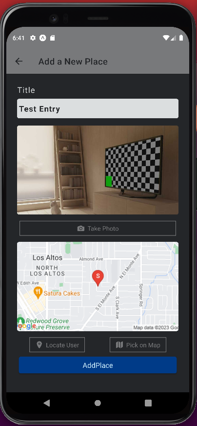

# Favorite Places Mobile App

## Description:

This is a React Native mobile app that allows the user to snap a photo, find their location on a map, pin that location, add a title for the entry, and save that location. 

This app was built using expo and some of its optional features. Building this app is part of the 2022 Udemy React Native course.<be />

## Contact

[www.williamlowrimore.com](https://www.williamlowrimore.com) 
[wlowrimore@gmail.com](mailto://www.wlowrimore@gmail.com) 
[www.linkedin.com](https://www.linkedin.com/in/william-lowrimore-21778310)